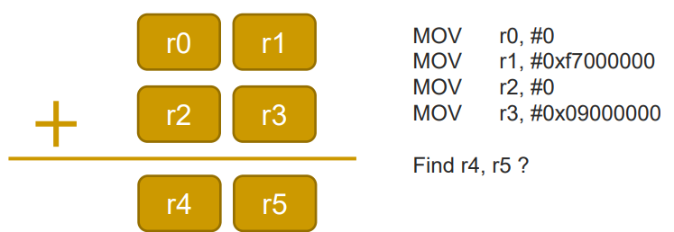
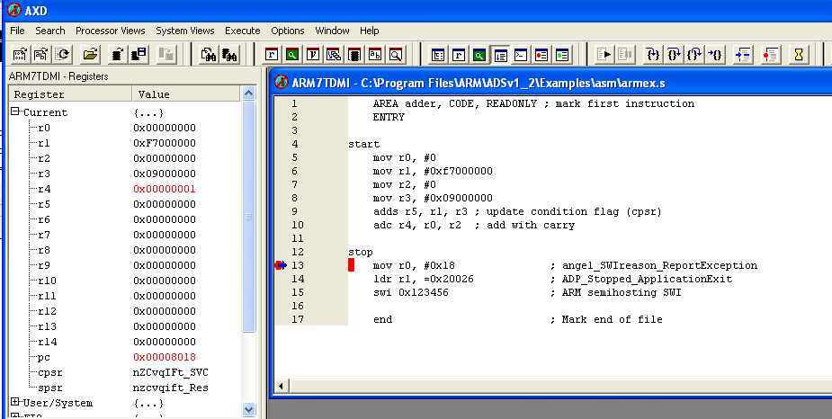
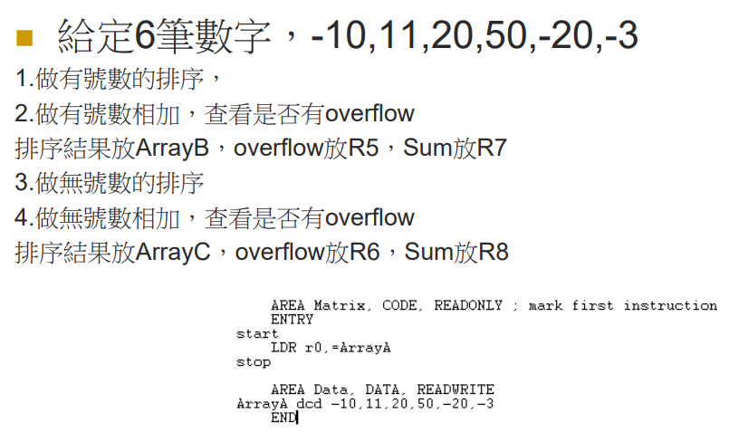
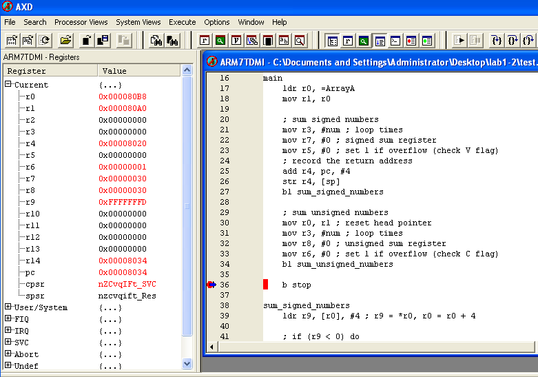
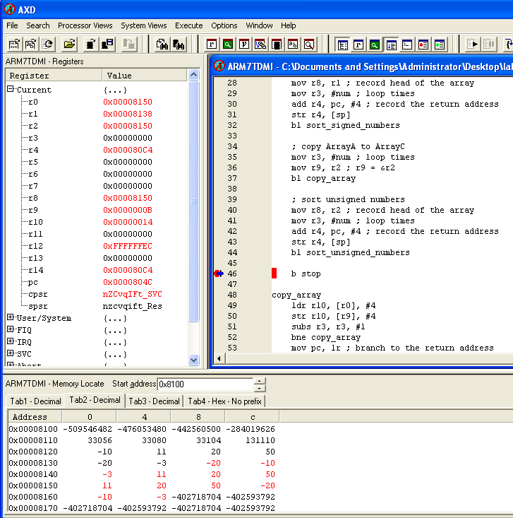
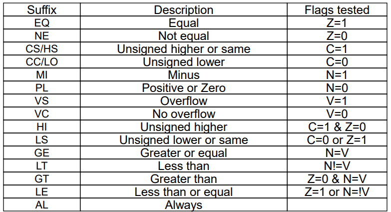
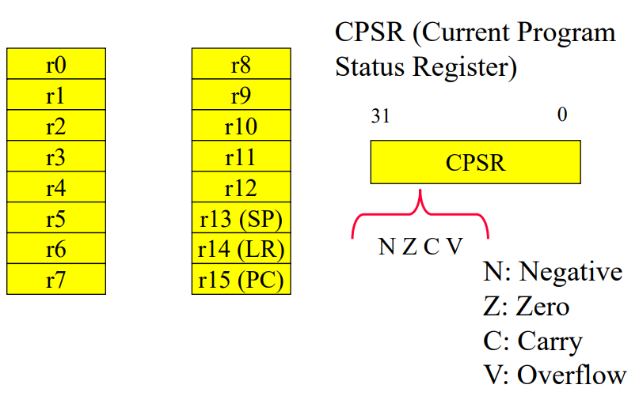

## Lab1-1

Question:

[Code](lab1-1.asm)

Result:

## Lab1-2

Question:

[Sum Code](lab1-2.asm)

[Sort Code*](lab1-3.asm)

Sum result:

Sort result:

*Sort reference in CPP:

# Common Conditions

