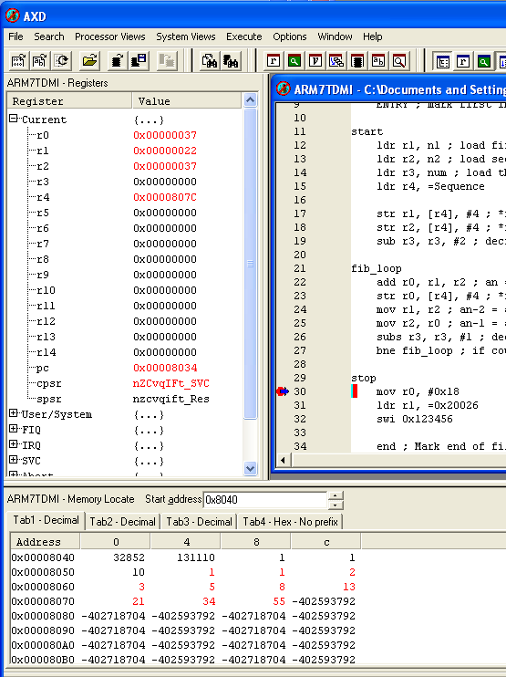
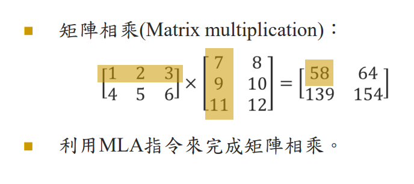
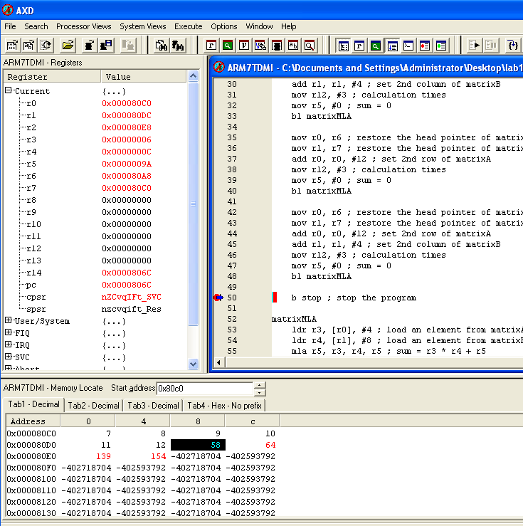
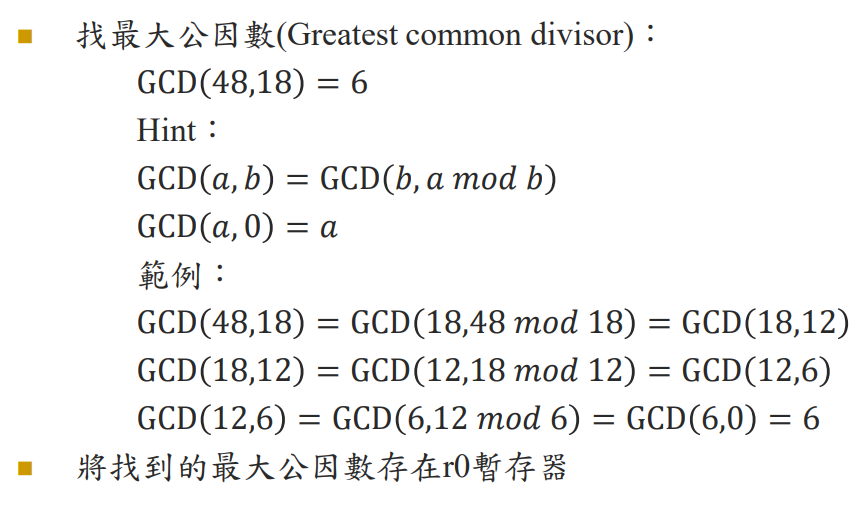
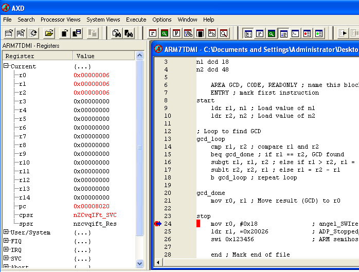

<b>Assembly Questions</b>

## Lab1-1

Question:

[Code](asm/lab1-1.asm)

Result:

## Lab1-2

Question:

[Sum Code](asm/lab1-2.asm)

[Sort Code*](asm/lab1-3.asm)

Sum result:

Sort result:

*Sort reference in CPP:

## Lab2-1

Question:

[Code](asm/lab2-1.asm)

Result:

## Lab2-2

Question:

[Code](asm/lab2-2.asm)

Result:

## Lab2-3

Question:

[Code](asm/lab2-3.asm)

Result:

# Common Conditions

